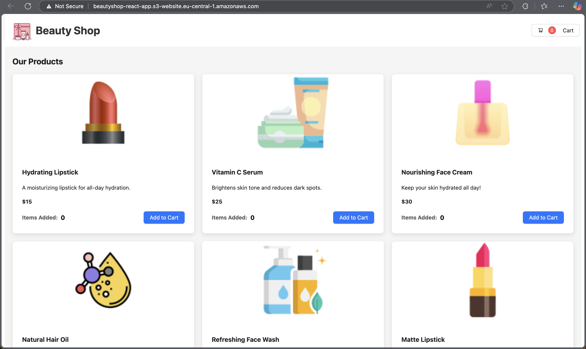
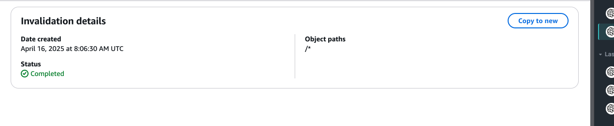
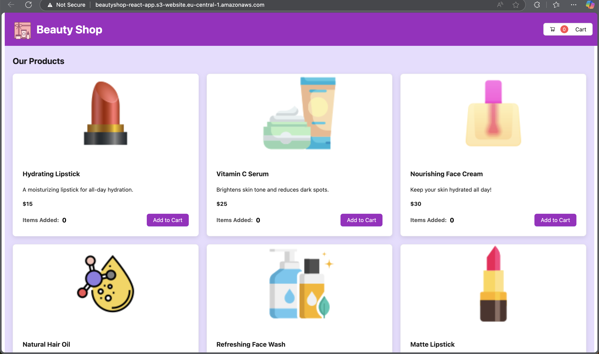

# React App Deployment with AWS

This project demonstrates **manual** and **automated deployment** of a React application using **AWS S3**, **CloudFront**, and optionally **AWS CDK** for automation.

---

## Deployment URLs

- **S3 Static Website URL:**  
  [http://beautyshop-react-app.s3-website.eu-central-1.amazonaws.com/](http://beautyshop-react-app.s3-website.eu-central-1.amazonaws.com/)

- **CloudFront Distribution URL (Manual):**  
  [https://d24wgdym3l5ulk.cloudfront.net/](https://d24wgdym3l5ulk.cloudfront.net/)

- **CloudFront Distribution URL (Automated):**  
  [https://dtvx9c0bha2qn.cloudfront.net/](https://dtvx9c0bha2qn.cloudfront.net/)

---

##  Screenshots

- **CloudFront Deployed App:**  
  

- **CloudFront Invalidation Configuration:**  
  *(All objects invalidated using `/*`)*  
  

- **UI Modification (After Invalidation):**  
  

---

## Manual Deployment

### Steps

1. **Build the**

# 2. React App Deployment (Automated)

- **CloudFront Distribution URL:**  
  [https://d24wgdym3l5ulk.cloudfront.net/](https://dtvx9c0bha2qn.cloudfront.net/)

## Deployment Process (Overview)

### 1. **Build the React application:**
   ```bash
   npm run build
   ```
   
# React App Deployment (Automated) — Using AWS CDK

  Deployment of a React application using **AWS CDK**, **S3**, and **CloudFront**, including automatic **cache invalidation**.

  - **CloudFront Distribution URL:**  
    [https://dtvx9c0bha2qn.cloudfront.net/](https://dtvx9c0bha2qn.cloudfront.net/)

  ---

  ##  Setup & Deployment

  ### 1. Install Dependencies

  ```bash
  npm install
  ```
### 2. **Bootstrap AWS (First Time Only)**
  ```bash
  npm run cdk:bootstrap
  ```
### 3. **Build & Deploy React App**

    * Builds React app
    * Uploads to S3
    * Deploys CDK stack
    * Invalidates CloudFront cache

  ```bash
  npm run aws:deploy
  ```

### 4. **Access App**

  After deployment, the terminal will output the CloudFront URL. Open it in browser to view the live app.

### 5. **Cleanup**

Use npm run aws:destroy to delete all AWS resources and avoid charges.

  ```bash
  npm run aws:destroy

  ```